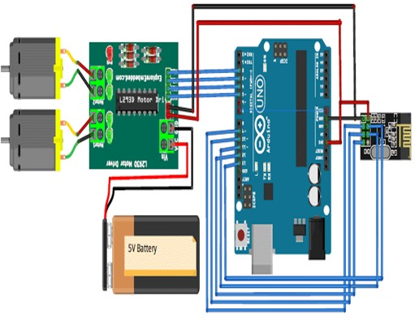

# Gesture Controlled Robot

## 🚀 Overview
This robot moves based on hand gestures using a smartphone app and Bluetooth communication.

## ⚙️ Features
- Gesture-based control via Android
- Bluetooth communication using HC-05
- Motor control via L298N
- Arduino Uno-based system

## 🧠 Working Principle (Short)
1. Phone detects gesture
2. Sends command via Bluetooth
3. Arduino processes command
4. L298N controls motors accordingly

## 🔧 Hardware Used
- Arduino Uno
- HC-05 Bluetooth Module
- L298N Motor Driver
- 4 DC Motors
- Smartphone with controller app

## 🧪 How to Run
- Upload `gesture_bot.ino` to Arduino
- Power the circuit
- Connect HC-05 via Bluetooth
- Use phone app to control

## 🔌 Circuit Diagram

## 📄 License
MIT License (optional)
